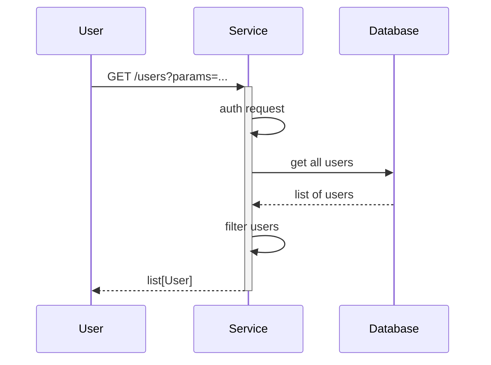

# Dependabot Policy Enforcer

[](https://github.com/nhs-england-tools/dependabot-policy-enforcer/actions/workflows/cicd-1-pull-request.yaml)
[](https://sonarcloud.io/summary/new_code?id=nhsdigital_nhs-england-tools_dependabot-policy-enforcer)

A GitHub Action that enforces age-based policies on Dependabot security alerts. It helps teams maintain security by ensuring that vulnerabilities are addressed within specified timeframes based on their severity.

- Checks open Dependabot alerts against configurable age thresholds
- Supports different thresholds for Critical, High, Medium, and Low severity alerts
- Provides detailed reports in PR comments and workflow logs
- Optional report-only mode for monitoring without failing builds

## Table of Contents

- [Dependabot Policy Enforcer](#dependabot-policy-enforcer)
  - [Table of Contents](#table-of-contents)
  - [Setup](#setup)
    - [Prerequisites](#prerequisites)
    - [Configuration](#configuration)
  - [Usage](#usage)
    - [Testing](#testing)
  - [Design](#design)
    - [Diagrams](#diagrams)
    - [Modularity](#modularity)
  - [Contributing](#contributing)
  - [Contacts](#contacts)
  - [Licence](#licence)

## Setup

Clone the repository

```shell
git clone https://github.com/nhs-england-tools/repository-template.git
cd nhs-england-tools/repository-template
```

### Prerequisites

The following software packages, or their equivalents, are expected to be installed and configured:

- [Python](https://www.python.org/downloads/release/python-3120/) 3.12 or later,

### Configuration

Installation and configuration of the toolchain dependencies

```shell
make config
```

## Usage

```yaml
name: Check Dependabot Alerts
on:
  schedule:
    - cron: '0 0 * * *'  # Daily check
  pull_request:
  workflow_dispatch:

permissions:
  security-events: read
  contents: read
  pull-requests: write  # Required for PR comments

jobs:
  check-alerts:
    runs-on: ubuntu-latest
    steps:
      - uses: your-username/dependabot-alert-checker@v1
        with:
          github-app-id: ${{ secrets.GITHUB_APP_ID }}
          github-installation-id: ${{ secrets.GITHUB_INSTALLATION_ID }}
          github-app-private-key: ${{ secrets.GITHUB_PRIVATE_KEY }}
          critical-threshold: 3
          high-threshold: 5
          medium-threshold: 14
          low-threshold: 30
          report-mode: false
```

### Permissions

This action requires:
- `security-events: read` to access Dependabot alerts
- `contents: read` to access repository content
- `pull-requests: write` (optional) to post comments on PRs

- `Dependabot alerts: Read` to access Dependabot alerts
- `Metadata: Read` default permission
- `Pull requests: Read and Write` to add comments to PRs

## Inputs

| Input | Description | Required | Default |
|-------|-------------|----------|---------|
| `github-app-id` | App ID for the GitHub app with the necessary permissions | Yes | N/A |
| `github-installation-id` | Installation ID for the GitHub app at the required organisation | Yes | N/A |
| `github-app-private-key` | Private Key for the GitHub app - note this *must* be stored as a secret | Yes | N/A |
| `critical-threshold` | Maximum age in days for Critical severity alerts | No | 3 |
| `high-threshold` | Maximum age in days for High severity alerts | No | 5 |
| `medium-threshold` | Maximum age in days for Medium severity alerts | No | 14 |
| `low-threshold` | Maximum age in days for Low severity alerts | No | 30 |
| `report-mode` | Run in report-only mode without failing | No | false |

### Testing

The action can be tested locally by running the `main.py` script with appropriate arguments.  Create a `.env` file in the root of the project and populate it with the required environment variables:

```bash
CRITICAL_THRESHOLD=3
HIGH_THRESHOLD=5
MEDIUM_THRESHOLD=14
LOW_THRESHOLD=30
REPORT_MODE=true
```

## Design

### Diagrams

The [C4 model](https://c4model.com/) is a simple and intuitive way to create software architecture diagrams that are clear, consistent, scalable and most importantly collaborative. This should result in documenting all the system interfaces, external dependencies and integration points.


The source for diagrams should be in Git for change control and review purposes. Recommendations are [draw.io](https://app.diagrams.net/) (example above in [docs](.docs/diagrams/) folder) and [Mermaids](https://github.com/mermaid-js/mermaid). Here is an example Mermaids sequence diagram:



### Modularity

Most of the projects are built with customisability and extendability in mind. At a minimum, this can be achieved by implementing service level configuration options and settings. The intention of this section is to show how this can be used. If the system processes data, you could mention here for example how the input is prepared for testing - anonymised, synthetic or live data.

## Contributing

Describe or link templates on how to raise an issue, feature request or make a contribution to the codebase. Reference the other documentation files, like

- Environment setup for contribution, i.e. `CONTRIBUTING.md`
- Coding standards, branching, linting, practices for development and testing
- Release process, versioning, changelog
- Backlog, board, roadmap, ways of working
- High-level requirements, guiding principles, decision records, etc.

## Contacts

Provide a way to contact the owners of this project. It can be a team, an individual or information on the means of getting in touch via active communication channels, e.g. opening a GitHub discussion, raising an issue, etc.

## Licence

> The [LICENCE.md](./LICENCE.md) file will need to be updated with the correct year and owner

Unless stated otherwise, the codebase is released under the MIT License. This covers both the codebase and any sample code in the documentation.

Any HTML or Markdown documentation is [© Crown Copyright](https://www.nationalarchives.gov.uk/information-management/re-using-public-sector-information/uk-government-licensing-framework/crown-copyright/) and available under the terms of the [Open Government Licence v3.0](https://www.nationalarchives.gov.uk/doc/open-government-licence/version/3/).
